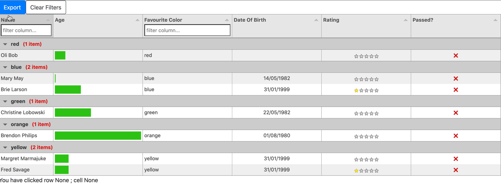

# dash_tabulator <!-- omit in toc -->


- [Features](#features)
- [Installation](#installation)
- [Usage](#usage)
- [Javascript Cell formatting](#javascript-cell-formatting)
- [Homepage](#homepage)

Dash tabulator is a Dash / Plotly component providing [Tabulator](http://tabulator.info/) capabilities.
This is not a fully comprehensive implementation of Tabulator just the basics necessary to get the application working.
Under the covers this uses [react-tabulator](https://github.com/ngduc/react-tabulator)



This is built on the shoulders of the Dash Plotly team, the Tabulator team, and the React Tabulator team.
This readme is probably longer than the code, due to the work of those individuals!


## Features
* [Tabulator Column settings ](http://tabulator.info/docs/4.1/columns)
  * Sorting / Filtering etc.
* Data loading through [Dash Plotly callbacks](https://dash.plotly.com/basic-callbacks) 
* Row Click Callbacks 
* Data Changed Callbacks (contains the new data table, note warning on this)
* Cell Edit Callbacks, capture the cell that was just changed, requires setting "editor":"input" etc.. on column header
* Download button to export as [csv / xlsx / pdf](http://tabulator.info/docs/4.2/download) 
  * XLSX & PDF require 3 party js scripts, see above link for details 
* Javascript formatters for cells
  * Contributed by Emil Haldrup Eriksen https://github.com/emilhe
  *  See pull request https://github.com/preftech/dash-tabulator/pull/11


## Installation

Installation can be done with pip in your dash project
```bash
pip install dash_tabulator
```

## Usage
Sample usage 

```python
import dash_tabulator
import dash
from dash.dependencies import Input, Output
import dash_html_components as html
import dash_core_components as dcc
from textwrap import dedent as d
import json

# 3rd party js to export as xlsx
external_scripts = ['https://oss.sheetjs.com/sheetjs/xlsx.full.min.js']

# bootstrap css
external_stylesheets = ['https://stackpath.bootstrapcdn.com/bootstrap/4.1.3/css/bootstrap.min.css']

# initialize your dash app as normal
app = dash.Dash(__name__, external_scripts=external_scripts, external_stylesheets=external_stylesheets)

styles = {
            'pre': {
                'border': 'thin lightgrey solid',
                'overflowX': 'scroll'
            }
        }

# Setup some columns 
# This is the same as if you were using tabulator directly in js 
# Notice the column with "editor": "input" - these cells can be edited
# See tabulator editor for options http://tabulator.info/docs/4.8/edit
columns = [
                { "title": "Name", "field": "name", "width": 150, "headerFilter":True, "editor":"input"},
                { "title": "Age", "field": "age", "hozAlign": "left", "formatter": "progress" },
                { "title": "Favourite Color", "field": "col", "headerFilter":True },
                { "title": "Date Of Birth", "field": "dob", "hozAlign": "center" },
                { "title": "Rating", "field": "rating", "hozAlign": "center", "formatter": "star" },
                { "title": "Passed?", "field": "passed", "hozAlign": "center", "formatter": "tickCross" }
              ]

# Setup some data
data = [
                {"id":1, "name":"Oli Bob", "age":"12", "col":"red", "dob":""},
                {"id":2, "name":"Mary May", "age":"1", "col":"blue", "dob":"14/05/1982"},
                {"id":3, "name":"Christine Lobowski", "age":"42", "col":"green", "dob":"22/05/1982"},
                {"id":4, "name":"Brendon Philips", "age":"125", "col":"orange", "dob":"01/08/1980"},
                {"id":5, "name":"Margret Marmajuke", "age":"16", "col":"yellow", "dob":"31/01/1999"},
                {"id":6, "name":"Fred Savage", "age":"16", "col":"yellow", "rating":"1", "dob":"31/01/1999"},
                {"id":6, "name":"Brie Larson", "age":"30", "col":"blue", "rating":"1", "dob":"31/01/1999"},
              ]

# Additional options can be setup here 
# these are passed directly to tabulator
# In this example we are enabling selection
# Allowing you to select only 1 row
# and grouping by the col (color) column 

options = { "groupBy": "col", "selectable":1}

# downloadButtonType
# takes 
#       css     => class names
#       text    => Text on the button
#       type    => type of download (csv/ xlsx / pdf, remember to include appropriate 3rd party js libraries)
#       filename => filename prefix defaults to data, will download as filename.type

downloadButtonType = {"css": "btn btn-primary", "text":"Export", "type":"xlsx"}


# clearFilterButtonType
# takes 
#       css     => class names
#       text    => Text on the button
clearFilterButtonType = {"css": "btn btn-outline-dark", "text":"Clear Filters"}


# Add a dash_tabulator table
# columns=columns,
# data=data,
# Can be setup at initialization or added with a callback as shown below 
# thank you @AnnMarieW for that fix


app.layout = html.Div([
    dash_tabulator.DashTabulator(
        id='tabulator',
        #columns=columns,
        #data=data,
        options=options,
        downloadButtonType=downloadButtonType,
        clearFilterButtonType=clearFilterButtonType
    ),
    html.Div(id='output'),
    dcc.Interval(
                id='interval-component-iu',
                interval=1*10, # in milliseconds
                n_intervals=0,
                max_intervals=0
            )

])


# dash_tabulator can be populated from a dash callback
@app.callback([ Output('tabulator', 'columns'), 
                Output('tabulator', 'data')],
                [Input('interval-component-iu', 'n_intervals')]) 
def initialize(val):
    return columns, data

# dash_tabulator can register a callback on rowClicked, 
#   cellEdited => a cell with a header that has "editor":"input" etc.. will be returned with row, initial value, old value, new value
# dataChanged => full table upon change (use with caution)
# dataFiltering => header filters as typed, before filtering has occurred (you get partial matching)
# dataFiltered => header filters and rows of data returned
# to receive a dict of the row values
@app.callback(Output('output', 'children'), 
    [Input('input', 'rowClicked'),
    Input('input', 'cellEdited'),
    Input('input', 'dataChanged'), 
    Input('input', 'dataFiltering'),
    Input('input', 'dataFiltered')])
def display_output(row, cell, dataChanged, filters, dataFiltered):
    print(row)
    print(cell)
    print(dataChanged)
    print(filters)
    print(dataFiltered)
    return 'You have clicked row {} ; cell {}'.format(row, cell)


if __name__ == '__main__':
    app.run_server(debug=True)

```

Be aware registering a callback for dataChanged will send the entire table back each time a change occurs
Make sure you are conscious of the amount of data you are round tripping. 

dataFiltering will return the filters before a match has occurred, usually a partial match
```python
[{'field': 'col', 'type': 'like', 'value': 'yello'}]
```

dataFiltered will return the header filter and the row data e.g.
```python
{
    'filters': [{'field': 'col', 'type': 'like', 'value': 'yellow'}], 
    'rows': [None, None, {'id': 5, 'name': 'Margret Marmajuke', 'age': '16', 'col': 'yellow', 'dob': '31/01/1999'}, {'id': 6, 'name': 'Fred Savage', 'age': '16', 'col': 'yellow', 'rating': '1', 'dob': '31/01/1999'}]}
```


## Javascript Cell formatting
Contributed in https://github.com/preftech/dash-tabulator/pull/11
Tabulator offers Javascript formatting of cells http://tabulator.info/docs/3.4?#formatting
These will be browser side javascript methods that have to be passed in the colum dict.

* Create an assets directory
  * See https://dash.plotly.com/external-resources for customization options
* Add a javascript file with a window.<CustomNameSpace> method
  * An example is provided in the assets/buttons.js file
  * Note the Namespace and the function printIcon 
* Register that method in your python app 
  * Using  dash_extensions.javascript.Namespace
* Add the registered function to your colums formatter


```python
from dash_extensions.javascript import Namespace
...
ns = Namespace("CustomNamespace", "tabulator")
...
columns = [{"formatter": ns("printIcon")}, ...]
```


## Homepage 

* https://github.com/preftech/dash-tabulator


